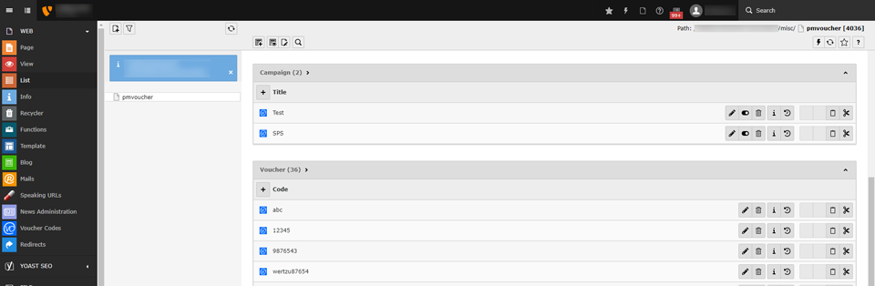
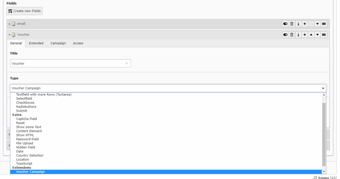
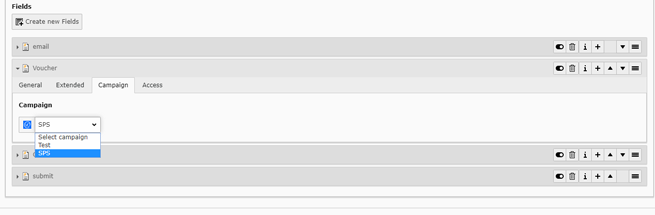
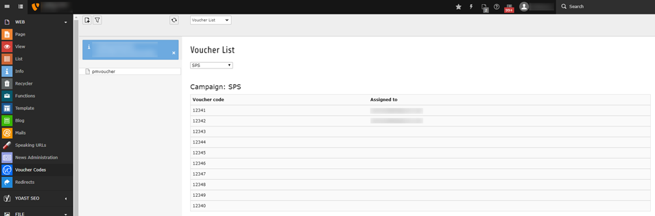
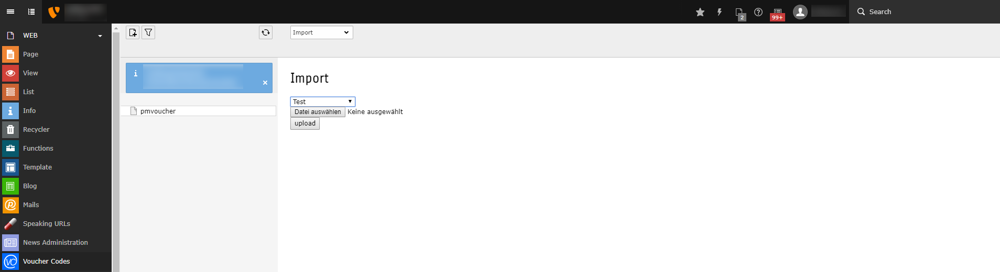

.. ==================================================
.. FOR YOUR INFORMATION
.. --------------------------------------------------
.. -*- coding: utf-8 -*- with BOM.

.. include:: ../Includes.txt

.. _introduction:

Introduction
============

.. _what-it-does:

What does it do?
----------------

Add campaigns with voucher codes to request them with a powermail form.
Let's imagine your client needs to provide voucher or ticket codes for fairs, now you can provide them with a Powermail form

.. _screenshots:

Screenshots
-----------

   Web list

   Add Voucher Campaign field to form

   Select campaign

   Backend Module - Voucher List

   Backend Module - Simple voucher code import
